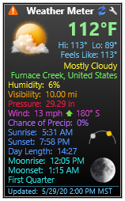

# Weather Meter for Yahoo
**Weather Meter for Yahoo Gadget inspired by the well-known AddGadgets.com Windows Sidebar gadgets.**

The Weather Meter for Yahoo Gadget is an alternate Weather Meter for people may be experiencing problems with Rainmeter weather skins that are based on data from The Weather Channel.

Please be aware that this Gadget has some limitations due to using Yahoo! as the data source. Use this Weather Meter only if you cannot get Weather Channel-based skins to work on your PC. See the list of regressions below.

**NOTE:** 
The installer is in the form of a patch, which will patch your existing [Gadgets](https://github.com/SilverAzide/Gadgets) installation without affecting your existing configuration or layouts. **_The Gadgets suite must be installed for this patch to function properly._**

## Features
* Displays the current weather for any location from [Yahoo! News](https://www.yahoo.com/news/weather/).
* Displays data in metric or imperial units.
* Shows current temperature, forecast high and low temperatures, "feels like" temperature, current conditions, current location, humidity, visibility, barometric pressure, wind speed, wind direction, and chance of precipitation.
* Shows current sunrise and sunset times, day length, and sun angle.
* Shows current moonrise and moonset times, moon phase and description, and moon angle.
* Shows complete 10 day forecast in a "flyout" window.
* Opens Google Maps for the observation location when location name is clicked.**\***
* Includes additional language translations: Bulgarian, Czech, English (GB), English (US), Finnish, French, German, Hebrew, Hungarian, Italian, Polish, Portuguese (BR), Russian, Serbian (SP), Slovak, Spanish (SP), Swedish, Ukrainian ([info](https://github.com/SilverAzide/Gadgets/wiki/HOW-TO-Change-the-default-language-or-temperature-units-of-the-Weather-Meter#how-to-change-the-default-language-or-temperature-units-of-the-weather-meter), source [here](http://fav.me/d2ylush)).
* Supports having multiple Weather Meters to allow monitoring more than one location ([info](https://github.com/SilverAzide/Gadgets/wiki/HOW-TO-Configure-the-Weather-Meter-to-show-multiple-locations#how-to-configure-the-weather-meter-to-show-multiple-locations)).
* Scales to any desired size.
* Includes variant gadget in a smaller size; expands to full size on mouseover.

## Regressions
* Yahoo! updates their weather data no more than once per hour (minimum) whereas The Weather Channel data is updated approximately every 10 minutes; this means the current conditions displayed on the Weather Meter for Yahoo gadget may be quite stale.
* Yahoo! does not provide any nightime-specific forecast data. The weather forecast "flyout" shows 10 days of forecast data instead of 5 days-and-nights forecast.
* Yahoo! does not have severe weather alerts.
* Yahoo! does not provide any wind conditions in the forecast, only in the current conditions.
* Yahoo! has limited coverage areas as compared to The Weather Channel, so it is possible your city or town may not be available.

## Requirements
Rainmeter 4.3.1 or later: <https://www.rainmeter.net>. 
[Gadgets 5.4.0 or later](https://github.com/SilverAzide/Gadgets). [Download the latest version here](https://github.com/SilverAzide/Gadgets/releases).

## Attribution
* Weather Meter for Yahoo gadget uses the [Yahoo.com](https://forum.rainmeter.net/viewtopic.php?f=118&t=34945) include templates by [Eclectic-Tech](https://eclectic-tech.deviantart.com) with modifications by me.
* Weather Meter for Yahoo gadget uses translations from [VClouds Weather 2](http://fav.me/d2ylush) by VClouds.
* Weather icons by JSMorley (and others) with modifications by me.
* Weather Meter for Yahoo gadget uses a Lua script from [Sunset-Moonrise](http://fav.me/d5ybxqr) by Mordasius to calculate sun/moon times.
* [Gadgets](https://github.com/SilverAzide/Gadgets) by [SilverAzide](https://github.com/SilverAzide).

## License
Creative Commons Attribution-Noncommercial-Share Alike 3.0 License
